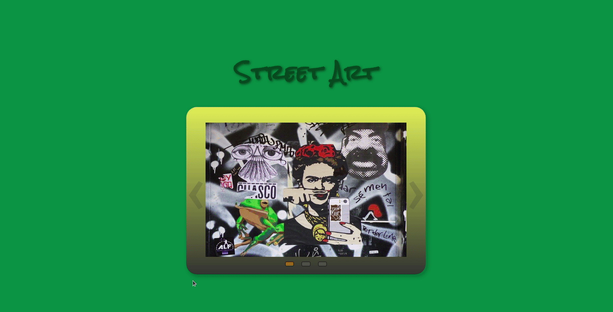

# Create an image slider

## :cartwheeling: Exercise

- Create an image slider with 5 images.
- The user should be able to switch to the next / previous image by using the left / right arrow navigation.
- Additionally the user should be able to switch to any image via the "control panel" at the bottom.
- Split your app into components.
- Add your preferred styling.

---

---
## :weight_lifting: Bonus - add a slideshow

- Add a play / pause button, to start / pause an automatic slideshow.
- The slideshow should play from the current image up to the last image and stop automatically, when at the first image again.

